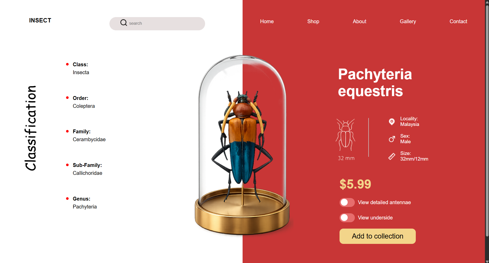

# 🐞 Insect UI Landing Page

A modern and responsive insect-themed landing page built using HTML and CSS.

## 🚀 Features

- Beautiful modern UI
- Split screen layout
- Insect information section
- Stylish buttons and navigation

---

## 🛠️ Technologies Used

- HTML5
- CSS3
- Flexbox

---

## 📸 Screenshot



---

## 📂 Folder Structure

```bash
project-folder/
│
├── index.html
├── style.css
├── README.md
│
└── assests/
    ├── insect.webp
    ├── small-insect.webp
    ├── search.png
    ├── map-pin-fill.png
    └── screenshot.png
```

---

## ▶️ How to Run

1. Download or clone the repository

```bash
git clone https://github.com/CodeWanderer25/Insecta.git
```

2. Open the project folder

3. Run `index.html` in browser

---

## ✨ Author

Priyanshu Goyal
